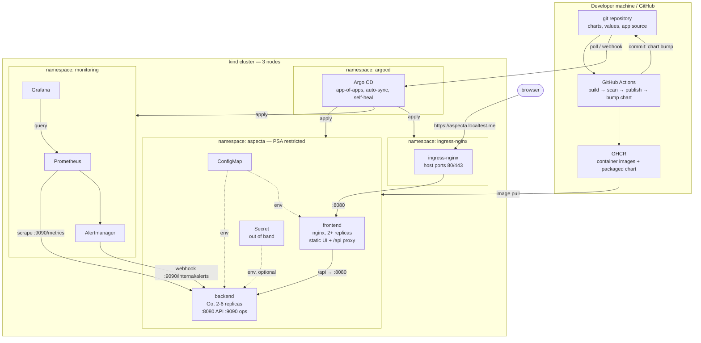
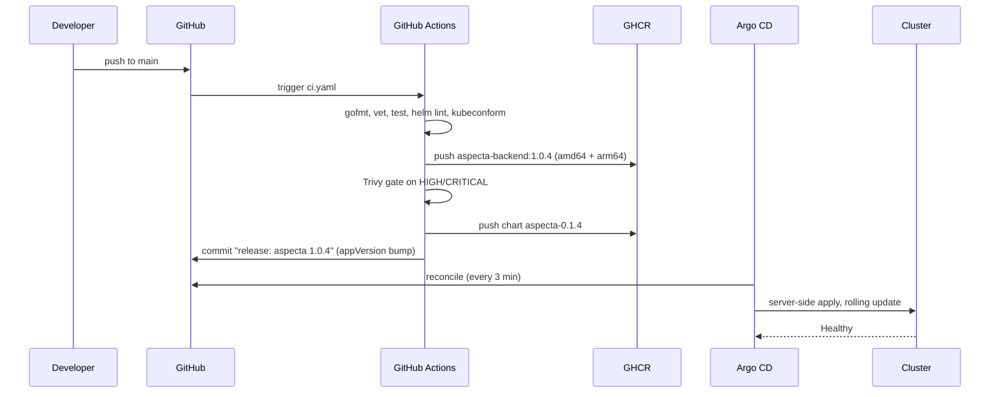

# Aspecta — production environment on Kubernetes

[](https://github.com/zajone/aspecta-prod-env/actions/workflows/ci.yaml)
[](https://github.com/zajone/aspecta-prod-env/actions/workflows/pr.yaml)
[](LICENSE)

A complete, reproducible **production** environment for a small web application:
frontend, backend, Helm packaging, GitOps delivery, a CI/CD pipeline, an
observability stack, and the security controls that make the difference between
"it runs" and "it may run in production".

```
git clone https://github.com/zajone/aspecta-prod-env && cd aspecta-prod-env && make up
```

One command, one environment. There is no `dev` overlay and no `values-staging.yaml`
in this repository — see [Why there is only one environment](#why-there-is-only-one-environment).

---

## Table of contents

- [Requirement coverage](#requirement-coverage)
- [What gets deployed](#what-gets-deployed)
- [Architecture](#architecture)
- [Quick start](#quick-start)
- [Repository layout](#repository-layout)
- [The application](#the-application)
- [Security](#security)
- [GitOps](#gitops)
- [CI/CD](#cicd)
- [Monitoring and alerting](#monitoring-and-alerting)
- [Day-two operations](#day-two-operations)
- [Verification](#verification)
- [Running this on your own GitHub account](#running-this-on-your-own-github-account)
- [Resource footprint](#resource-footprint)
- [Design decisions and trade-offs](#design-decisions-and-trade-offs)
- [Troubleshooting](#troubleshooting)

---

## Requirement coverage

Where each part of the specification is implemented, so nothing has to be
hunted for.

| # | Requirement | Implementation | File |
|---|---|---|---|
| 1 | Deployment for frontend and backend | two Deployments, 2+ replicas each, rolling update with `maxUnavailable: 0` | [`charts/aspecta/templates/backend-deployment.yaml`](charts/aspecta/templates/backend-deployment.yaml), [`frontend-deployment.yaml`](charts/aspecta/templates/frontend-deployment.yaml) |
| 1 | Service (ClusterIP) + Ingress | two ClusterIP Services, one HTTPS-only Ingress on `aspecta.localtest.me` | [`backend-service.yaml`](charts/aspecta/templates/backend-service.yaml), [`frontend-service.yaml`](charts/aspecta/templates/frontend-service.yaml), [`ingress.yaml`](charts/aspecta/templates/ingress.yaml) |
| 1 | ConfigMap and Secret for configuration | ConfigMap via `envFrom` with a `checksum/config` rollout trigger; Secret referenced with `optional: true` and provisioned out of band | [`configmap.yaml`](charts/aspecta/templates/configmap.yaml), [`secret.yaml`](charts/aspecta/templates/secret.yaml), [`docs/security.md`](docs/security.md#4--secrets) |
| 1 | Technology choice | kind (identical on WSL2, macOS and Linux) + **Helm** | [`clusters/kind/cluster.yaml`](clusters/kind/cluster.yaml), [`charts/aspecta/`](charts/aspecta/) |
| 2 | RBAC restricting access | workloads with zero API access and no projected token; two namespace-scoped Roles that cannot read Secrets or leave the namespace; Argo CD `AppProject` that cannot create Secrets or cluster-scoped objects | [`rbac.yaml`](charts/aspecta/templates/rbac.yaml), [`gitops/root/templates/00-projects.yaml`](gitops/root/templates/00-projects.yaml) |
| 2 | NetworkPolicy between namespaces / pods | default-deny for every pod, then pod-to-pod (frontend → backend) and namespace-to-namespace (ingress → frontend, monitoring → backend `:9090`); backend has no egress at all | [`networkpolicy.yaml`](charts/aspecta/templates/networkpolicy.yaml) |
| 2 | TLS everywhere | cert-manager with a private CA; every Ingress carries a certificate, port 80 answers only with a 308, HSTS and TLS 1.2+ enforced controller-wide | [`platform/cert-manager/`](platform/cert-manager/), [`platform/ingress-nginx/values.yaml`](platform/ingress-nginx/values.yaml) |
| 3 | GitOps workflow | Argo CD app-of-apps, two projects, seven Applications, sync waves, `prune` + `selfHeal` | [`gitops/`](gitops/) |
| 3 | Deployment automated on a git change | CI commits the chart bump; Argo CD reconciles that commit and rolls the update out — CI holds no cluster credential | [`ci.yaml`](.github/workflows/ci.yaml), [`gitops/root/templates/40-aspecta.yaml`](gitops/root/templates/40-aspecta.yaml) |
| 4 | CI/CD pipeline | GitHub Actions: validate → build → release, plus a pull-request gate with a full end-to-end run on kind | [`.github/workflows/`](.github/workflows/) |
| 4 | Container build | multi-arch (`amd64` + `arm64`) buildx, distroless runtime, SBOM, provenance attestation, Trivy gate | [`ci.yaml`](.github/workflows/ci.yaml), [`apps/backend/Dockerfile`](apps/backend/Dockerfile) |
| 4 | Helm chart package update when the image changes | one job bumps `appVersion` (which *is* the image tag), bumps the chart `version`, packages it, pushes it to GHCR as an OCI artifact and commits the bump | [`ci.yaml` → `release-chart`](.github/workflows/ci.yaml) |
| 5 | Prometheus + Alertmanager stack | kube-prometheus-stack, sized for a laptop, with a `ServiceMonitor` shipped by the application chart | [`platform/monitoring/values.yaml`](platform/monitoring/values.yaml), [`servicemonitor.yaml`](charts/aspecta/templates/servicemonitor.yaml) |
| 5 | Basic alerts | 3 recording rules and 10 alerts, each with a `runbook_url`; Alertmanager routing, grouping, inhibition and a webhook receiver | [`prometheusrule.yaml`](charts/aspecta/templates/prometheusrule.yaml), [`docs/runbook.md`](docs/runbook.md) |
| 5 | Dashboard | Grafana dashboard as code in a ConfigMap, imported by the sidecar: SLO, RED, saturation, edge and TLS across five rows | [`charts/aspecta/dashboards/aspecta-overview.json`](charts/aspecta/dashboards/aspecta-overview.json) |
| 5 | Service level objective | Target, error budget and multi-window burn rate as recording rules, shared by the dashboard and the alerts | [`prometheusrule.yaml`](charts/aspecta/templates/prometheusrule.yaml), [`values.yaml`](charts/aspecta/values.yaml) |
| 6 | Documentation | this README plus the architecture, security and runbook documents | [`docs/`](docs/) |

Beyond the specification: HorizontalPodAutoscalers, PodDisruptionBudgets,
topology spread, graceful shutdown, Pod Security Admission, `values.schema.json`
validation, an in-cluster `helm test` suite, and `make verify` /
`make verify-security` scripts that assert the whole thing — including the
negative security cases — against a live cluster.

---

## What gets deployed

| Layer | Component | Version | Delivered by |
|---|---|---|---|
| Cluster | kind, 1 control plane + 2 workers | Kubernetes 1.34.0 | `scripts/bootstrap.sh` |
| GitOps | Argo CD | chart 10.8.4 | `scripts/bootstrap.sh` (the only imperative step) |
| Ingress | ingress-nginx | chart 4.15.1 | Argo CD |
| Autoscaling | metrics-server | chart 3.14.0 | Argo CD |
| Observability | kube-prometheus-stack — Prometheus, Alertmanager, Grafana, kube-state-metrics, node-exporter | chart 90.0.0 | Argo CD |
| Application | `aspecta` — backend (Go) + frontend (nginx) | chart `charts/aspecta` | Argo CD |
| CI/CD | GitHub Actions — build, scan, publish, chart release | — | GitHub |

Everything except the cluster and Argo CD itself is declared in this repository
and reconciled from git.

---

## Architecture



### The request path

1. The browser resolves `aspecta.localtest.me` to `127.0.0.1` (public DNS —
   no `/etc/hosts` edit needed on any platform).
2. kind forwards host ports 80 and 443 into the control-plane node, where
   ingress-nginx listens on both. Port 80 answers with a `308` to `https://`
   and nothing else.
3. ingress-nginx terminates TLS with a certificate cert-manager issued from
   this environment's own CA, then routes the host to the **frontend** ClusterIP
   Service.
4. nginx serves the static UI and reverse-proxies `/api/` to the **backend**
   ClusterIP Service — so the browser only ever talks to one origin, and the
   backend needs no public route of its own.
5. The backend answers from an in-memory catalogue compiled into the binary.

Both Services are `ClusterIP`. The only ingress point into the cluster is the
Ingress object, and it is reachable over TLS only.

Traffic from the ingress controller to the pods is plaintext, on purpose: it
never leaves the node, and encrypting it is the job of a service mesh rather
than of five hand-written Ingress objects. What that trade means, and when it
stops being acceptable, is written down in
[`docs/security.md`](docs/security.md#5--tls).

### Why the frontend proxies the API instead of a second Ingress path

Routing `/api` straight to the backend from the Ingress would save one network
hop. Proxying through nginx was chosen instead because it makes the backend
genuinely private: it has **exactly one** legitimate client inside the cluster,
which is what allows the NetworkPolicy to be a pod-to-pod allow-list rather than
a namespace-wide one. The extra hop costs about 0.3 ms on a loopback network.

---

## Quick start

### Prerequisites

| Requirement | WSL2 / Linux | macOS |
|---|---|---|
| Container runtime | Docker Engine, running | Docker Desktop or OrbStack, running |
| `kubectl` | any 1.30+ | `brew install kubectl` |
| `git`, `bash`, `curl`, `make` | preinstalled | preinstalled |
| Free RAM | 6 GB minimum, 8 GB recommended | same |
| Free CPU | 2 minimum, 4 recommended | same |
| Host ports | 80 and 443 must be free | same |

`kind`, `helm`, `kubeconform` and `yq` are **not** prerequisites — they are
downloaded at pinned versions into `./bin` by `scripts/install-tools.sh`, for
the current OS and CPU architecture. Nothing is installed system-wide and
nothing needs `sudo`, so this repository cannot disturb the tool versions
another project on the same machine depends on. Apple silicon is handled: the
tools are fetched as `darwin/arm64` and the images are published for
`linux/arm64` as well as `linux/amd64`.

### Bring the environment up

```bash
make preflight     # optional: checks RAM, CPU, disk, docker and host ports first
make up            # ~8-12 minutes on a first run, most of it pulling images
```

`make up` is idempotent — re-run it any time; every step checks the current
state before acting.

When it finishes it prints:

```
  Application     https://aspecta.localtest.me
  Argo CD         https://argocd.localtest.me        admin / <generated>
  Grafana         https://grafana.localtest.me       admin / <generated>
  Prometheus      https://prometheus.localtest.me
  Alertmanager    https://alertmanager.localtest.me
```

Re-print them at any time with `make urls`.

Every host is HTTPS only. The certificates are signed by a CA that cert-manager
generates inside the cluster, so trust it once:

```bash
make trust-ca        # installs the CA into the system trust store (asks for sudo)
```

After that every URL above validates normally in the browser and in `curl`.
Without it, `curl` needs `--cacert .tls/aspecta-ca.crt` — which is exactly what
`make verify` does, so the checks validate the real chain instead of skipping
verification with `-k`. `make certs` lists every certificate and its expiry,
`make untrust-ca` reverses the trust step.

### Tear it down

```bash
make down            # deletes the cluster
make clean-images    # also removes the built images
```

### Low-memory mode

```bash
make up MONITORING=off
```

Leaves out the observability stack — and, because their CRDs then do not exist,
automatically disables the ServiceMonitor, the alert rules and the dashboard in
the application chart. Footprint drops to roughly 2 GB.

---

## Repository layout

```
apps/
  backend/          Go service: catalogue API, /metrics, Alertmanager receiver
  frontend/         static UI (3 files, no build step) + nginx config template
charts/aspecta/     the application Helm chart - one chart, one environment
  dashboards/       Grafana dashboard as code, imported by the sidecar
  templates/tests/  helm test smoke suite that runs inside the cluster
clusters/kind/      cluster topology: 3 nodes, host ports 80/443
platform/           values for the platform components, and the namespaces
  namespaces.yaml   namespaces with their Pod Security Admission levels
gitops/
  bootstrap/        the single root Application, applied once by bootstrap.sh
  root/             app-of-apps: two Argo CD projects + four Applications
scripts/            bootstrap, verify, verify-security, lint, teardown, ...
docs/
  architecture.md   component and data-flow detail, and what was left out
  security.md       the threat model, every control, and how to prove it
  runbook.md        one section per alert, linked from the alert itself
.github/workflows/
  ci.yaml           push to main: build, scan, publish, release the chart
  pr.yaml           pull request: validate, build, and a full e2e on kind
```

---

## The application

**Aspecta** is a catalogue of deep-sky objects — 26 Messier entries with
constellation, magnitude, distance and discovery data.

It is deliberately *not* a to-do list or a hit counter. It was chosen because it
makes the infrastructure demonstrable:

- **The dataset is embedded in the binary** with `go:embed`. No database, no
  PersistentVolume, no init container, no migration job. The service is
  genuinely stateless, so "run more replicas" and "reschedule a pod" are not
  qualified statements.
- **The image is small and almost empty.** A static Go binary on
  `distroless/static:nonroot` is **4 MB to pull**, 18 MB unpacked, and contains
  no shell, no package manager and no libc — which is why the Trivy gate in CI
  can be set to fail on any HIGH or CRITICAL finding and still pass. (The
  frontend is 21 MB to pull, almost all of it the nginx alpine base.)
- **It exposes metrics worth alerting on.** `aspecta_catalogue_objects`,
  `aspecta_search_queries_total{outcome}` and a latency histogram tuned for a
  sub-millisecond API mean the alert rules are about *this service*, not just
  about CPU and memory. All four golden signals are covered by the code rather
  than inferred from the outside: `aspecta_http_requests_in_flight` is the
  saturation signal a counter cannot reconstruct, and
  `aspecta_start_time_seconds` is what puts restart markers on the dashboard.
- **It is an Alertmanager receiver.** The backend implements the Alertmanager
  webhook contract on its operations port and renders incoming notifications in
  its own UI, so the whole alert path — rule fires, Alertmanager routes and
  groups, receiver acknowledges, NetworkPolicy permits — is visible without a
  Slack workspace or a PagerDuty account.

### API

| Method | Path | Purpose |
|---|---|---|
| `GET` | `/api/v1/objects?q=&type=&constellation=&page=&size=` | paginated, filtered catalogue |
| `GET` | `/api/v1/objects/{id}` | one object, `404` with a JSON error envelope if unknown |
| `GET` | `/api/v1/stats` | banner, version, counts by type, uptime, active alerts |
| `GET` | `/api/v1/alerts` | alerts received from Alertmanager |
| `POST` | `/internal/maintenance` | drain this replica — operations port only, requires `X-Aspecta-Token` |

On the operations port (`:9090`, never exposed through the Ingress):

| Method | Path | Purpose |
|---|---|---|
| `GET` | `/healthz` | liveness — process health only |
| `GET` | `/readyz` | readiness — `503` while draining or in maintenance |
| `GET` | `/metrics` | Prometheus exposition |
| `POST` | `/internal/alerts` | Alertmanager webhook receiver |

Splitting the ports is what lets one NetworkPolicy grant Prometheus and
Alertmanager access to `:9090` while `:8080` stays reachable only from the
frontend pods.

### Configuration

`ConfigMap` (`charts/aspecta/templates/configmap.yaml`) carries `APP_BANNER`,
`LOG_LEVEL`, `LOG_FORMAT`, `PAGE_SIZE_DEFAULT`, `PAGE_SIZE_MAX`,
`FEATURE_SEARCH`, `ALERT_BUFFER_SIZE`, `DRAIN_DELAY`, `SHUTDOWN_TIMEOUT` and the
`BACKEND_ADDR` that the frontend's nginx template substitutes at start-up. The
Deployments carry a `checksum/config` annotation of the rendered ConfigMap, so
changing a value rolls the pods — which a bare `envFrom` reference would not do.

`Secret` carries `ADMIN_TOKEN`. It is **not** rendered from git — see
[Secrets](#secrets).

---

## Security

Full detail and the threat model are in [docs/security.md](docs/security.md).
Everything below is asserted against the running cluster by
`make verify-security`.

### Workload hardening

Both workloads run as non-root with a read-only root filesystem, all
capabilities dropped, `allowPrivilegeEscalation: false` and the
`RuntimeDefault` seccomp profile. Every path nginx writes to at runtime is an
explicit in-memory `emptyDir`. The `aspecta` namespace enforces the
**`restricted`** Pod Security Standard, so the API server rejects a privileged
pod even if a manifest asked for one.

### RBAC

Least privilege in two layers:

1. **The workloads have no API access at all.** Their ServiceAccount has no
   Role bound to it and `automountServiceAccountToken: false`, so no token is
   projected into the pods. A compromised container holds no cluster credential.
2. **Operating the service** is split into two *namespace-scoped* Roles —
   `aspecta-viewer` (read plus pod logs) and `aspecta-operator` (also restart,
   evict and scale). Neither is a ClusterRole, so neither can read a single
   object in another namespace. Neither can read a Secret, which is what keeps
   the admin token out of reach of an on-call engineer who does not need it.
   `create` and `delete` on Deployments are deliberately absent: the desired
   state comes from git, and a hand-edit would be reverted by Argo CD anyway.

Argo CD adds a third layer: the `aspecta` AppProject may only deploy from this
repository, only into the `aspecta` namespace, and **cannot create a Secret or
any cluster-scoped object** — a whole class of privilege-escalation mistakes is
rejected at sync time instead of being applied.

### NetworkPolicy

Zero trust inside the namespace, built as deny-first plus a minimal allow-list:

| Policy | Effect |
|---|---|
| `aspecta-default-deny` | all ingress **and** egress denied for every pod in the namespace, including pods added later |
| `aspecta-frontend` | ingress only from the `ingress-nginx` namespace on `:8080`; egress only to cluster DNS and to the backend `:8080` |
| `aspecta-backend` | ingress from frontend **pods** on `:8080` and from the `monitoring` **namespace** on `:9090`; `egress: []` — no outbound connections at all, not even DNS |

That covers both cases the task asks for: pod-to-pod (frontend → backend) and
namespace-to-namespace (monitoring → backend, ingress → frontend).
`make verify-security` proves the negative cases too — a pod in another
namespace, and an unlabelled pod inside the same namespace, are both dropped.

### Secrets

No credential is committed, and the application chart renders **zero** Secret
objects (asserted in CI). `scripts/bootstrap.sh` generates a random admin token
and Grafana password on the machine and creates the Secrets directly. The
container references the Secret with `optional: true`, so a cluster without it
starts normally and simply keeps the privileged endpoint closed (`501`) —
failing closed rather than failing to start.

This is also the honest answer to "secrets in GitOps": the chart supports
`secret.existingSecret`, so the production upgrade path is to have the External
Secrets Operator or Sealed Secrets produce that same Secret from a real vault.
`docs/security.md` shows the manifest.

### Supply chain

Images are built from pinned base images, published with a multi-arch manifest,
scanned by Trivy with `exit-code: 1` on HIGH/CRITICAL, and accompanied by an
SBOM and a signed [build provenance attestation](https://docs.github.com/actions/security-for-github-actions/using-artifact-attestations)
tying the digest to the workflow and commit that produced it. Every upstream
Helm chart is pinned to an exact version.

---

## GitOps



**Argo CD is the only thing that writes to the cluster.** The pipeline has no
cluster credentials at all — it changes git, and git changes the cluster. That
is what makes the environment auditable: `git log` on `charts/aspecta/Chart.yaml`
is the deployment history.

The structure is a plain **app-of-apps**:

- `gitops/bootstrap/root-application.yaml` — one Application, applied once by
  `bootstrap.sh`, with the repository URL, branch and image owner substituted
  from `git remote`. That substitution is why a fork deploys itself with no file
  edits.
- `gitops/root/` — a small chart that renders two `AppProject`s and seven
  `Application`s, ordered by sync wave:

  | Wave | Application | Why here |
  |---|---|---|
  | -1 | `namespaces`, `prometheus-operator-crds` | namespaces must exist to install into; the CRDs must exist before anything can create a `ServiceMonitor` |
  | 0 | `cert-manager` | every Ingress below asks it for a certificate, so its CRDs and webhook have to be answering first |
  | 1 | `cert-manager-issuers` | the CA itself. Separate from the chart because an `Issuer` cannot be applied until cert-manager's own validating webhook is up — one Application containing both would deadlock on its own webhook |
  | 2 | `ingress-nginx`, `metrics-server` | both ship a `ServiceMonitor`, so they need wave -1 first |
  | 3 | `monitoring` | publishes Grafana, Prometheus and Alertmanager through Ingress objects, which Argo CD only reports healthy once a controller has claimed them |
  | 4 | `aspecta` | last, once the platform it depends on is healthy |

  Extracting the CRDs into their own Application is what breaks the dependency
  cycle between those last two rows — and it is the right thing anyway, because
  a CRD has a different lifecycle from the workloads that use it, and pruning
  one would delete every custom resource of that kind in the cluster. That
  Application is the one place in the repository where `prune` is switched off.

Every Application has `prune: true` and `selfHeal: true`: the cluster is not
allowed to drift from git. Delete a Deployment by hand and it is back within the
reconciliation window; delete a file from git and the object is pruned.
Platform components use **multi-source** Applications — the chart from the
upstream Helm repository, the values from this git repository — so nothing is
vendored and the values stay reviewable in a pull request.

---

## CI/CD

### `ci.yaml` — push to `main`

| Job | What it does |
|---|---|
| `validate` | `gofmt`, `go vet`, `go test -race -cover`, `shellcheck`, `helm lint`, renders every chart, validates 40 rendered objects against the real Kubernetes and CRD schemas with `kubeconform -strict`, and asserts that `values.schema.json` actually rejects bad input. Resolves the next semantic version. |
| `build` | Builds `backend` and `frontend` in parallel for `linux/amd64` **and** `linux/arm64`, publishes to GHCR with three tags (version, `sha-<commit>`, `latest`), attaches an SBOM and a provenance attestation, then fails the job on any fixable HIGH/CRITICAL vulnerability. |
| `release-chart` | Bumps `version` and `appVersion` in `Chart.yaml`, re-renders the chart to prove it still references the new image, packages it and pushes it to GHCR as an OCI artifact, commits the bump back to `main` and tags `v<version>`. |

**This is the "package the chart when the image changes" requirement:** the
chart's `appVersion` *is* the image tag (`charts/aspecta/values.yaml` leaves
`image.tag` empty on purpose), so one commit moves both, and there is no way for
the chart and the image it deploys to drift apart.

The bump commit is made with the default `GITHUB_TOKEN`, which by design cannot
trigger another workflow — that, plus `[skip ci]` in the message, is what keeps
the pipeline from looping.

### `pr.yaml` — pull request

Same validation, plus two things that only make sense before a merge:

- a **rendered-manifest diff** posted to the job summary — far more reviewable
  than a diff of Helm templates, and where an accidental change to a probe or a
  policy becomes obvious;
- a **full end-to-end run**: a throwaway kind cluster is created in the runner,
  the images are built and loaded, ingress-nginx and the chart are installed,
  the `helm test` suite runs, and the NetworkPolicy and RBAC restrictions are
  asserted with real traffic and real `auth can-i` checks.

That last job is the answer to "will this work on someone else's machine?" — it
proves the whole deployment converges from a clean slate on infrastructure that
has never seen this repository before.

### The chain, observed

Worth stating precisely, because it is the part that is easy to claim and hard
to demonstrate. A commit was pushed; CI published `1.0.1` to GHCR and committed
the chart bump; Argo CD reconciled that commit on its own; and the kubelet
pulled the image from the registry:

```console
$ curl -s https://aspecta.localtest.me/api/v1/stats | jq -r .version
1.0.3
$ kubectl -n aspecta get deploy aspecta-backend \
    -o jsonpath='{.spec.template.spec.containers[0].image}'
ghcr.io/zajone/aspecta-backend:1.0.3
$ kubectl -n aspecta get events | grep Pulled
Successfully pulled image "ghcr.io/zajone/aspecta-backend:1.0.3" in 16.307s.
  Image size: 5234910 bytes
```

Nobody ran `kubectl apply`, `helm upgrade` or `docker push` by hand between the
commit and those 5 MB arriving on the node.

---

## Monitoring and alerting

The chart ships its own observability, so the workload and the way it is
observed are versioned and reviewed together:

- **`ServiceMonitor`** — scrapes `:9090/metrics` every 30 s. Go runtime metrics
  that nobody reads are dropped with a `metricRelabeling`, and the pod name is
  kept as a label so one misbehaving replica can be found.
- **`PrometheusRule`** — **24 recording rules and 13 alerts** in six groups.
  Every expensive expression is evaluated once by Prometheus and reused by both
  the alerts and the dashboard, so the two cannot disagree about what "the
  error rate" means.
- **A service level objective, defined once.** `monitoring.prometheusRule.slo`
  in `values.yaml` sets the target (99.5% of requests not answered with a 5xx,
  over 3 days). Everything downstream is derived from it by recording rule —
  the error budget, the burn rate over six windows, the budget remaining — so
  the dashboard gauge, the burn-rate alerts and the objective itself are the
  same number rather than three copies of it.
- **Grafana dashboard as code** — a ConfigMap labelled `grafana_dashboard: "1"`,
  imported by the Grafana sidecar into an `Aspecta` folder. It is never clicked
  together by hand, so it survives a Grafana restart and arrives through the
  same Argo CD sync as the code it describes.

### The dashboard

`Aspecta / Service overview`, five rows, deliberately ordered so the top of the
screen answers "is it healthy?" and everything below answers "why?":

| Row | Answers |
|---|---|
| Service level objective | Error budget remaining, the indicator against its target, and burn rate across three windows |
| Traffic, errors and latency | The RED signals: rate by route, status classes stacked, latency quantiles, p95 per route |
| Saturation and capacity | CPU and memory **as a fraction of each container's own limit**, replicas against the autoscaler's ceiling, restarts |
| Edge and TLS | Requests as ingress-nginx sees them, the 308 redirect volume that proves the HTTPS enforcement is live, and every certificate with its remaining lifetime |
| Application | Catalogue size, searches by outcome, the alert-receiver feed, and which versions are running |

Three choices in it are worth stating, because they are the ones usually got
wrong:

- **Colours are pinned per series, not assigned by position.** Grafana's default
  palette colours the first series blue, the second orange, and so on — so a
  route that stops receiving traffic silently repaints every route after it. An
  override per route and per host keeps a colour attached to the thing it names.
- **Latency quantiles share one hue, light to dark.** p50, p95 and p99 are an
  ordered family of the same measurement, not three unrelated series, and a
  sequential ramp says so without needing the legend.
- **No panel has two y-axes.** Where two measures of different scale would have
  been tempting to overlay, they are either two panels or normalised to a
  common base — which is why saturation is plotted as a fraction of the limit
  rather than as cores beside a limit line.

### The alerts

| Alert | Fires when | Severity |
|---|---|---|
| `AspectaBackendDown` | a replica stops answering scrapes for 2 min | critical |
| `AspectaBackendTargetMissing` | the scrape target vanishes entirely for 5 min | critical |
| `AspectaDeploymentUnavailable` | a Deployment has zero available replicas for 3 min | critical |
| `AspectaCatalogueEmpty` | a replica serves an empty catalogue — a broken image reached production | critical |
| `AspectaHighErrorRate` | 5xx ratio above 5 % for 5 min | warning |
| `AspectaHighLatency` | p95 above 500 ms for 10 min | warning |
| `AspectaPodRestartingTooOften` | more than 3 restarts in 15 min | warning |
| `AspectaAutoscalerAtMaximum` | an HPA sits at `maxReplicas` for 15 min | warning |
| `AspectaCatalogueRevisionMismatch` | replicas report different versions for 15 min — a stuck rollout | warning |
| `AspectaMaintenanceModeLeftOn` | a replica has been drained for 30 min | warning |
| `AspectaErrorBudgetBurningFast` | 14.4x burn over 1 h **and** 5 min — the budget is gone in two days | critical |
| `AspectaErrorBudgetBurningSlow` | 6x burn over 6 h **and** 30 min | warning |
| `AspectaErrorBudgetExhausted` | no error budget left for the window | warning |

The two burn-rate alerts use the multi-window pattern: each requires a long
window and a short one to agree, so a long window alone cannot keep paging for
hours after a brief incident has already ended.

TLS is watched separately, in
[`platform/monitoring/values.yaml`](platform/monitoring/values.yaml), because
certificates belong to the platform rather than to any one application:

| Alert | Fires when | Severity |
|---|---|---|
| `TLSCertificateExpiringCritical` | a certificate expires within 7 days | critical |
| `TLSIssuerNotReady` | the CA `ClusterIssuer` cannot sign — nothing can renew | critical |
| `TLSCertificateExpiringSoon` | a certificate expires within 21 days, well past its 30-day renewal point | warning |
| `TLSCertificateNotReady` | cert-manager cannot issue or renew a certificate | warning |
| `TLSHostServedByFallbackCertificate` | a named host is answered with the wildcard — an Ingress merged without an issuer annotation | warning |

Every host is HTTPS-only, so an expired certificate is a full outage of that
host rather than a browser warning. These are the rules that make it something
Prometheus reports three weeks ahead instead of something a user discovers.

Every alert carries a `runbook_url` pointing at the matching section of
[docs/runbook.md](docs/runbook.md), so the person woken up gets instructions,
not just a metric name.

Alertmanager groups by `alertname`, `namespace` and `severity`, inhibits
warnings while a critical alert for the same problem is open, routes the
`Watchdog` dead-man's-switch to a null receiver, and delivers everything else to
the application's webhook. The four `kube-prometheus-stack` component monitors
that cannot be scraped in kind (etcd, scheduler, controller-manager, kube-proxy)
are disabled deliberately — permanently firing alerts nobody can act on are how
teams learn to ignore alerts.

### See it work

```bash
make test-alert
```

Posts a synthetic alert to Alertmanager's own API — so it has to traverse
routing, grouping, the webhook receiver and the NetworkPolicy — and waits for it
to appear in the application UI. To watch a *real* rule fire instead:

```bash
kubectl -n aspecta scale deployment aspecta-backend --replicas=0
# AspectaDeploymentUnavailable fires after 3 minutes; watch it in the UI panel
kubectl -n aspecta scale deployment aspecta-backend --replicas=2
```

---

## Day-two operations

```bash
make status            # what Argo CD thinks of every application, plus the workloads
make urls              # URLs and generated credentials
make logs              # tail the backend's structured JSON logs
make pods              # resource usage of every pod
make sync              # force a reconciliation instead of waiting for the interval
make admin-token       # print the admin token
```

**Scaling.** Both components have an HPA (backend 2→6, frontend 2→4, CPU
target 70 %/75 %) with an asymmetric `behavior` — scale out fast, scale in over
a five-minute window so the autoscaler cannot flap. `replicas` is deliberately
absent from the Deployments while autoscaling is on, so Argo CD does not fight
the HPA over the replica count.

**Rolling updates** use `maxUnavailable: 0, maxSurge: 1`: capacity is added
before old pods are retired. On `SIGTERM` the backend fails its readiness probe
first, waits `DRAIN_DELAY` for the endpoint change to propagate, and only then
stops accepting connections — so a rollout drops no requests.

**Rollback.** Because the deployment is a commit, so is the rollback:

```bash
git revert <release commit> && git push    # Argo CD rolls back within the interval
# or, for an immediate manual rollback:
kubectl -n aspecta rollout undo deployment/aspecta-backend
# note: self-heal will restore the git state, which is the point
```

**Draining one replica** without touching the Deployment:

```bash
kubectl -n aspecta port-forward pod/<backend-pod> 9090:9090 &
curl -X POST http://127.0.0.1:9090/internal/maintenance \
  -H "X-Aspecta-Token: $(make -s admin-token)" \
  -d '{"enabled":true}'
```

The replica reports `503` on `/readyz`, leaves the Service endpoints, keeps
passing liveness (so Kubernetes does not kill it), and `aspecta_maintenance_mode`
goes to 1 — which trips `AspectaMaintenanceModeLeftOn` if it is forgotten.

---

## Verification

Three layers, all runnable locally:

```bash
make lint              # everything CI runs statically: Go, Helm, kubeconform, shell
make verify            # end-to-end: Argo CD health, Ingress, API, Prometheus targets,
                       # loaded alert rules, queryable metrics, Grafana, Alertmanager
make verify-security   # RBAC (positive and negative), PSA rejection, NetworkPolicy
                       # enforcement from another namespace and from inside it
make smoke             # the chart's own helm test suite, from inside the cluster
```

`make verify-security` is the one worth reading: it asserts that
`aspecta-viewer` *cannot* read Secrets, that the workload ServiceAccount
*cannot* list pods, that a privileged pod is *rejected*, that a pod in another
namespace *cannot* reach the backend, and that a pod in the same namespace
without the right labels *also* cannot — while confirming the flows that must
work still do.

---

## Running this on your own GitHub account

Nothing in this repository is hard-coded to one account. Fork it, or:

```bash
gh repo create <your-name>/aspecta-prod-env --public --source=. --push
make up
```

`bootstrap.sh` reads `git remote get-url origin` and derives the Argo CD
repository URL, the branch and the GHCR image owner from it, then passes them to
the root Application as Helm parameters. **No file needs editing.**

What happens next, and what you should expect:

| | |
|---|---|
| **Cluster** | `make up` creates it locally. GitHub Actions does not create clusters — CI builds and releases, Argo CD deploys. |
| **First run** | The images are built locally and loaded straight into kind, so the environment comes up even before CI has ever run and with no registry credentials. |
| **Every push after that** | CI publishes to *your* GHCR under `ghcr.io/<your-name>/`, bumps the chart, and Argo CD rolls it out within three minutes - the pods pull the new image straight from the registry. |
| **Private repository** | Argo CD needs a read credential: `argocd repo add <url> --username <user> --password <PAT>`, or add a `repo-creds` Secret in the `argocd` namespace. |
| **GHCR package visibility** | Packages published by Actions from a **public** repository inherit its visibility, so the cluster pulls them anonymously with no credential and no manual step - verified end to end here. For a **private** repository, either make the two packages public once under *Packages → Package settings*, or add an `imagePullSecret` through `global.image.pullSecrets`. |

---

## Resource footprint

Measured with `kubectl top` on WSL2 (6 vCPU, 12 GB memory ceiling) once the
environment had settled:

| Namespace | Memory | Notes |
|---|---|---|
| `kube-system` | 1304 Mi | etcd, API server, scheduler, controller manager, CoreDNS, kindnet, kube-proxy, metrics-server across 3 nodes |
| `monitoring` | 1101 Mi | Prometheus (24 h retention, no PV), Alertmanager, Grafana, kube-state-metrics, 3x node-exporter |
| `argocd` | 357 Mi | controller, repo-server, API server, redis - dex, notifications and applicationset disabled |
| `ingress-nginx` | 93 Mi | |
| **`aspecta`** | **21 Mi** | **all four application pods** - the Go backend runs in about 7 Mi per replica |
| `local-path-storage` | 12 Mi | kind's default storage provisioner |
| **Total across the 3 node containers** | **4.8 GiB** | including the nodes' own container runtimes |

The application itself is 0.4 % of that: essentially all of the memory belongs
to Kubernetes and to the observability stack, which is the normal shape of a
small production environment and the reason the monitoring values are tuned
rather than left at their chart defaults.

Every component has an explicit memory `limit` - Grafana's was raised to 512 Mi
after 256 Mi was OOM-killed during its start-up database migrations, which is
the kind of number that has to be measured rather than guessed. Neither
application container has a CPU limit — deliberately: CPU throttling on a latency-sensitive request
path damages p95 far more than it protects a node, and the memory limit is what
actually contains a noisy neighbour.

---

## Design decisions and trade-offs

### Why there is only one environment

The task asks for production. A `dev` overlay would have been easy to add and
would have made the repository worse: two value files drift, and the one that is
not deployed rots. Anything that genuinely differs per cluster — the image
owner, the Ingress host — is a parameter injected by the Argo CD Application,
not a second copy of the configuration. The chart has a single `values.yaml`,
and a `values.schema.json` that fails the render on a typo.

### Why kind, not minikube

kind runs Kubernetes in Docker containers, which is the same primitive on WSL2
and on macOS, so one `cluster.yaml` gives everyone an identical cluster.
Multi-node is a two-line change, `kind load docker-image` removes the registry
from the first-run path entirely, and CI can spin the same cluster up in a
runner in about 40 seconds — which is what makes the e2e job possible.

### Why Go and no frontend framework

Both choices are about the deployment story, not about taste. A static Go binary
on distroless has no shell and no libc, which makes `readOnlyRootFilesystem`,
`runAsNonRoot` and a zero-tolerance Trivy gate genuinely easy rather than a
fight. A frontend with no bundler and no CDN means no `node_modules` in the
supply chain, no build step in CI, and a Content-Security-Policy that can forbid
every external origin outright.

### What is deliberately missing for a real production cluster

Stated plainly, because pretending otherwise would be worse:

- **A publicly trusted certificate.** TLS itself is in place and enforced, but
  the CA is private, because `*.localtest.me` resolves to `127.0.0.1` and can
  never pass an ACME HTTP-01 or DNS-01 challenge. The migration is one field:
  point the `cert-manager.io/cluster-issuer` annotations at an ACME
  `ClusterIssuer` instead of `aspecta-ca`. Every Ingress, every `Certificate`
  and every renewal path stays exactly as it is.
- **Encryption between the ingress controller and the pods.** TLS terminates at
  the edge; the hop to the pod is plaintext on the node's own network. A cluster
  that needs mTLS between workloads adds a service mesh, not a certificate per
  Deployment.
- **Persistent storage.** Prometheus writes to ephemeral storage with 24 h
  retention. A real cluster sets `storageSpec` to a StorageClass, and adds Thanos
  or a remote-write target for long-term history.
- **Secret management.** Generated on the machine by `bootstrap.sh` rather than
  synced from a vault. The chart already accepts an externally managed Secret,
  which is the whole migration.
- **High availability of the control plane** and of Argo CD, both single-replica
  here.
- **Authentication in front of Prometheus and Alertmanager.** Grafana requires a
  login; those two are reachable to anyone who can reach the loopback Ingress,
  over TLS but without authentication. A real cluster puts an identity provider
  or oauth2-proxy in front of them.
- **Log aggregation.** Both workloads log structured JSON to stdout precisely so
  a Loki or ELK pipeline can be added without touching the applications, but no
  log backend is deployed — the task asks for Prometheus and Alertmanager, and a
  log store would have doubled the memory footprint.

---

## Troubleshooting

| Symptom | Cause and fix |
|---|---|
| `port 80 on 127.0.0.1 is already in use` | Another web server or Docker container holds it. Stop it, or change `extraPortMappings` in `clusters/kind/cluster.yaml`. |
| `aspecta.localtest.me` does not resolve | Offline or split-horizon DNS. Run `make hosts-entry` and add the printed line to `/etc/hosts` (`C:\Windows\System32\drivers\etc\hosts` on Windows). |
| The browser warns about the certificate | The environment's CA is not trusted yet. `make trust-ca`, then restart the browser. Firefox keeps its own trust store and has to be pointed at `.tls/aspecta-ca.crt` by hand; the command prints the steps. |
| `curl: (60) SSL certificate problem` | Same cause. Either `make trust-ca`, or pass `--cacert .tls/aspecta-ca.crt`. Do not reach for `-k` — it would hide exactly the failure worth seeing. |
| A `Certificate` is stuck not `Ready` | `make certs` for the overview, then `kubectl describe certificate <name> -n <ns>` and `kubectl -n cert-manager logs deploy/cert-manager`. Almost always the `aspecta-ca` `ClusterIssuer` is not ready yet, which resolves itself once wave 1 has synced. |
| A page redirects to `https` forever | HSTS is cached in the browser for a year after the first visit. Clear the entry for the host (`chrome://net-internals/#hsts`) if the environment is ever deliberately downgraded. |
| An Argo CD application is `OutOfSync` | `make status`, then `kubectl -n argocd describe application <name>`. During the first sync this is normal while upstream charts are still being fetched. |
| `ImagePullBackOff` on the application | The images were not loaded into the cluster. `make build` (it builds and loads), or make the GHCR package public. |
| An HPA shows `<unknown>/70%` | metrics-server needs about a minute of data after start-up. `kubectl top pods -n aspecta` confirms when it is ready. |
| Pods are `Pending` with insufficient memory | `make down && make up MONITORING=off`, or raise the WSL memory ceiling in `%UserProfile%\.wslconfig`. |
| The whole bootstrap failed halfway | It is idempotent: fix the cause and run `make up` again. `make down && make up` for a clean slate. |

---

## Licence

MIT — see [LICENSE](LICENSE).
